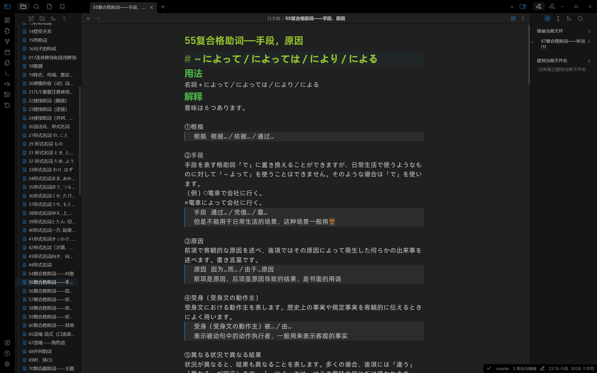
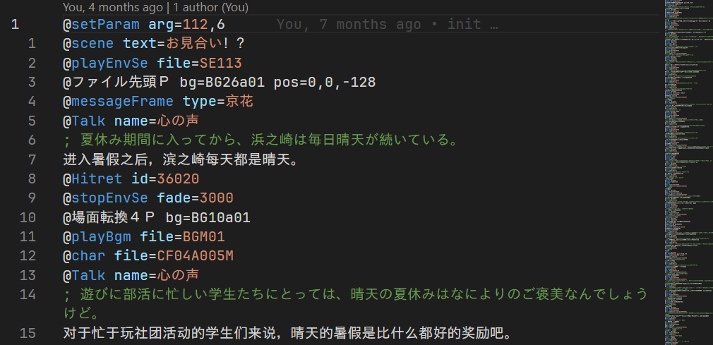

# 写在前面
- 本文章只是个人向的学习经验分享，主要就是讲讲自己是怎么学习的，用的工具和方法之类的。希望大家理性甄别，博观约取，总结出自己的一套方法。
- 本文面向的对象主要是满足以下情况的人群：
    - 想学日语，但目的很单纯，就是为了推生肉; 如果你想同时也过N1或N2的话，那么找一门正经的课可能更适合你。
    - 觉得系统的日语的学习很枯燥，想要寻找一种相对快乐一些的学习方法。(学习一门语言从来就不是什么易事，虽说是相对快乐，但并不意味着就轻松，该投入的时间还是要投入的)
    - 有一定的折腾能力，包括但不限于科学上网(非必要，但最好能有)，基本的游戏解包(看看别的大佬是如何翻译的)，寻找游戏和工具资源等。
    - (非必要)想要汉化一部作品，关于这点，如果你只是以学习日语为目的的话，做汉化是一件非常没有效率的事情。因为会有相当一部分的时间是在纠结中文问题而非日语问题。但如果你想体验一下汉化的感觉，那么这也是一个不错的选择。但千万别选长篇废萌，翻译到后面会很无聊。

# 自学的原因

## 出发点

我原本是想老老实实跟着网课学的，但是说实话太枯燥了，大学生本来就学业繁忙，还受这学习之苦，有点遭不住。

其实仔细思考一下，我学个日语只是为了推 GAL 而已，为什么要学那么多感觉都用不上的内容呢，所以我才决定自学，自学的好处就是需要多少学多少，而且不那么枯燥。

当然缺点也很明显，知识太过碎片化，需要自行总结和积累; 而且刚开始学习的时候，基本上看一句话就要查一下生词，很难感受到游戏的乐趣。

其实系统地学习并不一定会比自学慢，只是没有自学那种循序渐进的满足感，碰到一个问题自己解决了，而且解决了立刻就能用得上，这比留在心里等老师教，或是学了但不知道有什么用带来的感觉是不一样的。

## 选择

当然我也在网上参考了很多自学的相关经验分享，最后决定先给语法入个门，然后直接开始啃生肉。
我就在 b 站找了门日语语法的课程，认认真真地看了一半，当时还是一条一条地认真做笔记，后面就不做了。感觉后面的内容琐碎起来了之后，我就找了个生肉直接开啃。下面是我当时做的笔记，说实话做了那么久的笔记，现在一眼都不看了。

后面想着，反正啃都啃了，不如做个汉化吧，虽然现在非常的后悔，不过都已经干了那么多了，也就善始善终吧。

# 工欲善其事，必先利其器

说实话这个年代，要自学一个门语言早就不像曾经那样又是买书又要找老师了，当然找书找老师仍然是一个非常主流且有效的方法。我想表达的意思是，自学已经不像以前那样困难了，互联网如此庞大的信息量，网络上的公开资源一抓一大把。下面是我自己自学中用到的一些学习工具。

## GPT-3/GPT-4/NewBing

这一类的 AI 大语言模型基本就可以相当于你的老师了，GPT4 完全是碾压 GPT3 的，NewBing 和 GPT 各有优缺。

## 其他汉化文本

翻译毕竟和理解意思是两码事，能理解意思并不意味着能翻译好，因此如果能获取足够量的汉化文本，就可以在不知道如何翻译，或是不知道如何理解的时候有一个参考了。

## 词典

这个就不用多说了，词典是必备的，我用得比较多的是 Moji 和 Weblio。

## 背单词

学任何一门语言都得背单词的，但对于自学而言，我的目的是能看懂生肉，而且我不希望去学习一些我不知道在哪能用得上的词汇，
因此网上现有的考级的词库可能不太适合我，因此答案也就呼之欲出了——Anki，这个软件可以自定义卡片，碰到不认识的直接加进去就行。

当然如何制作卡片也是一门学问了，这点放在后面再谈。

## Google

碰到不理解的句子，google 的答案比百度好太多了，bing 我没试过不太清楚。

但在没有能力阅读日文互联网上的资料之前，中文互联网上的内容也不失为一个选择

## Twitter/X
社交媒体就是最好的例句库，对于一些流行语，或是哪怕是看了字典的意思也不明白在句子中到底是什么意思的词语。直接扔进社交媒体中一搜往往能解决问题。看看他们本地人是怎么用的，找找这其中的语感什么的。

# 具体流程

## 前置知识
要学日语，首先得会五十音图吧，这个就不用多说了，最刚开始学一门语言，接触这些新的东西就是非常痛苦的，逃也逃不过去，只能硬着头皮学了。

然后就是基本的语法，网上找一门专门教日语语法的课程，掌握日语的语法结构，保证在面对简单句时能够正确地进行分词，只有能做到正确的分词，才能正确地搜索并查询词语的意思。

## 选择一部游戏
首先得找一部游戏，最好是一部有汉化的游戏(如果你不想同时将它汉化的话)，这样你就可以对着汉化来理解了，事半功倍。

你也可以找一些同时有中日双语的游戏，这类游戏大多在steam可以找到，这样能省去很多折腾，但不能复制日文原文还是一大硬伤。

## 获取游戏文本中日文本对照
如何方便地进行中日文本的对照，很大程度上决定了你的学习效率。
最简单的方法自然就是找一部有中日双语的游戏，但这类游戏并不多，而且文本也不好复制，因此以下的一些方法也是可以考虑的。
### 解包
关于解包游戏文本，github各个引擎基本都有相关的工具可以用，就是需要稍微折腾一下，不过一劳永逸。
如果不会解包也无所谓，游戏文本不是必须的，只是复制起来更方便而已，
当然你也可以用其他的方法获取文本。

### OCR/VNR
翻译器这块实在是太多了，我了解得不是特别多，但之前一直在用LunarTranslator感觉还挺好用的。
稍微配置一下就可以复制出原文了，主流的游戏HOOK成功的概率还是很高的，OCR的话可能需要考虑一下准确率和费用的问题。

## 选择一个合适的文本阅读环境
如果你选择的是同时有中日对照的游戏，那外挂一个VNR用来复制原文，就已经很完美了。

如果你选择了解包文本，那么有以下两种情况：
- 你只解包了日文文本，那选择一个你喜欢的文本编辑器就可以直接打开汉化游戏开始学习了。
- 你同时拥有汉化与日文文本，那可以考虑写个脚本将生肉和汉化文本合并到一起，以本汉化补丁为例(这里为了方便汉化直接用游戏本身的ks文件，你也可以单独提取出来放到新的文件里)：


如果你无法得到游戏的汉化文本，游戏也不是双语的。那就只能开两个游戏，把一个调成静音然后对照着看了。

> 如过你想获得更好的单词检索和卡片制作体验可以看看[这个视频](https://www.bilibili.com/video/BV1Hh4y1N7h3)，使用浏览器插件yomichan配合Anki来推GAL。我个人尝试了一下感觉还不错。但我选择的是用中日文本转成json格式然后再`python -m http.server`。但后来还是放弃了，因为用这个插件做的卡片内容太冗余了，自己总结一下还可以加深印象。


## (可选)获取其他汉化文本作为参考
至于其他汉化文本，它们之中很多都是有特殊加密的，并且很多汉化组的申明中都有提到禁止解包（当然你自己解包自己用，不公开传播是没人管得了你的），因此我并不会提供相关的资源，但是网上其实已经有一些公开的汉化文本了，包括一些开源的汉化GAL，以及一些汉化解包合集和其他零星的解包教程。

获取文本后选择一个你最喜欢的文本编辑器，使用它的全局搜索功能便能有效地索引定位。
Execl 兴许也是个选择，但我没用过，Word 面对这么大规模的文本肯定会卡死吧，当然，还可以选择命令行工具 ripgrep 之类的。

## 开始啃生肉
然后万事具备，就可以开始啃生肉了。
### 分析理解句子
在啃生肉的过程中，一般不能理解的句子可以分为以下几类：

- 生词
- 语法
- 省略
- 思维方式差异
- 流行语
- 长难句

对于生词和语法，查一查基本上就能解决很多问题了，实在碰到不管什么意思放进去都不通顺的情况，那就看看别人是如何翻译类似的句子的。

省略句和思维方式的差异全部都得靠语感和积累，因此如果你是像我一样打算汉化一部没人汉化的生肉的话，推荐同时你也最好啃一部有人汉化的游戏，对比别人的翻译，你就能解决很多语感方面的问题。

流行语这东西，全靠你的互联网搜索能力了，因为很多时候有的梗真的很难翻译，所以我还是推荐找一部文本中规中矩的生肉，少来些谐音梗或是现代的抽象话语。

至于长难句，对于初学者来说，如果不能正确地对文本进行分词，就不知道应该查那个单词。
网上有一些在线日语分词的工具，Moji好像就有，但要钱我没用过。
但现在AI已经非常强大了，直接让它给你分析分析语法，然后你再自己琢磨琢磨，这样就能解决很多问题了。

## 温故而知新
学一门语言背单词是永远绕不开的东西，之前也提到了，自学的话是没有现成的词库的，因此你得自己去做单词卡。
对于这个需求，除了Anki外应该没有其他的选择了吧。

# 个人实际经验分析
这部分是翻译完之后再写的，想找到一个合适的例句实在是太难了，所以有的例句可能并不是很恰当，但主要还是学习一下方法吧。
## 基本的分词

前面也说了，AI分词还是很好用的，例如这句话：

> ただ、萌莉のことが気がかりでいてもたってもいられないだけだ。

其实只要能发现`いてもたってもいられない`这个固定短语基本不成问题，但如果不知道的话，那就很难抓到重点了。
于是我们把它扔给 NewBing

> 请分析一下下面这句话的语法结构和意思
> ただ、萌莉のことが気がかりでいてもたってもいられないだけだ。

得到如下回答：
```
这句话是日语。它的意思是“只是，我太担心萌莉了，无法安心。”这句话的语法结构如下：

- 「ただ」意为“只是”，表示转折。
- 「萌莉のことが気がかりで」意为“担心萌莉”，其中「のことが」表示关注的对象，「気がかりで」意为“担心”。
- 「いてもたってもいられないだけだ」意为“无法安心”，其中「いてもたってもいられない」是一个固定短语，意为“无论做什么都无法安心”，「だけだ」表示程度，意为“仅仅是”。
```
可以看到对于基本的分词 AI 还是很准确的。

## 思维差异

日语和中文在很多句子的表达习惯和思维方式上差异比较大，举一个[例子](https://okwave.jp/qa/q5706300.html)，提问者不能理解为什么日语中表示破音要用“裏返”，然后这个帖子的第一个回答我觉得非常棒。
```
補足を拝見すると【裏返る】の言葉にこだわりがあるようですが？

【裏返る】裏が表に、表が裏になる。ひっくりかえる。 
声が裏返る→裏返った声→裏声（普段と違う声）
裏声＝中国語の假嗓子jia3sang3zi小嗓子xiao3sang3ziでしょうか。
意図的に使うのが、
　京劇や昆曲などで女形の使う声。
　邦楽では新内節，清元節，小唄、歌舞伎の女形の使う声。
　ヨーデルで使う声。
　音楽用語の　 falsetto 。
中国語では声を喉＝嗓子で表し、天然に対して、非天然を假jia3
日本語では自然な声を表と考え、そうでないのを裏の声。
　　　表現の違いです。
　注：表声という語は辞書にはありません、言うならば表の声です。

音楽や芸能では意図的に表／裏使い分けますが、
緊張や興奮のあまり、意に反して思わず裏声が出てしまうのを、
“声が裏返る”と言います。
そのような時は、喉が渇いたような引き攣れたような感じになっています。

ご質問の小説の場合は、金額を言った男も勝負を目の前にして
相当に緊張していたということでしょう。

＊こんな説明でご質問の意図に合っていますでしょうか？
```
中国人习惯用真声假声来形容，而日本人更习惯用里声表声来形容，但说的都是一个东西。

<!-- 再比如这句话：
> 八雲姉が立ち上がって、風呂の縁に**腰掛け**た。

查一查`腰掛け`这个词语，发现这个词语的意思竟然是坐下，但这和“腰”有什么关系呢？
然后继续搜索，你会发现同样表达坐下，大致有[三种说法](https://detail.chiebukuro.yahoo.co.jp/qa/question_detail/q10224690125)：｢腰を下ろす｣，｢腰をかける｣以及｢座る｣。这其中的细微差别并不是我们要关心的，只是这三个说法有两个用到了“腰”，再结合这个短语的词典解释：`尻を物の上に載せる。 物の上に尻をおろして休む。`，再加上这个短语的直译`用……支撑腰部`，我们大致便可以判断这就是单纯的惯用表达方式上的差异。

对于这种惯用表达其实没必要深究其具体原因，但知道原因也能帮助我们更好地记住这个词语。 -->

## 动作与行为
对于一些动作与行为的词语，特别如果带有一些修辞手法的词语，理解起来可能会有些困难，例如下面这句。
> 四条院さんが**飛び上がった**拍子に、猫が飛び上がって
駆けだした。

我们可以通过图片搜索来理解这个词语，例如以下是搜索`飛び上がる`的结果：

从中立马便可以理解这个词语的意思了，就是一跃而起，而且往往带有惊慌的感觉。

## 看看别的大佬是如何翻译的？
例如这句话：
> 「今は……萌莉が可愛すぎて、ちょっと**反動**がきそうだ」

去词典搜索这个词语的意思，你只能得到这样的抽象回答：
```
反動 | はんどう ◎
[名] 反动，反作用；后坐。（作用の向きと反対の方向に生じる力や作用。）
```
但此处用的显然应该是引申意，因此我们搜一下其他人是如何翻译的：
大多数人还是直接翻译成了反作用：

> 5638:「どちらかというと、記憶力がいいだけよ。過去の仁の思考パターンを紐解いたら、そろそろ反動が来る頃かなと思って」
> 5639-「不管从哪方面来说，只能说是记忆力好而已吧。分析以前的仁的思考模式的话，我想差不多该是有**反作用**的时候了吧」

也有选择意译的：
> 18298:俺はかける言葉もなく、その姿を見ていた。張り切ってた分、反動も大きいんだろうな。
> 18299-我没有回答，只是看着那副身姿。所谓期望越大，**随之而来的失望就越大**吧。

当然还有翻译成`反弹`的，直接翻译成`反动`的，还有`副作用的`，但大概意思是差不多的。

此处我选择了意译，翻译成了“「只是……萌莉现在的样子太可爱了，感觉要压制不住了」”
